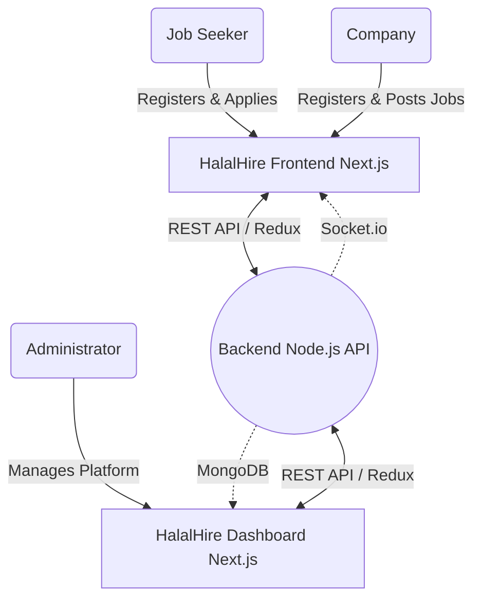

# 🌙 HalalHire Admin Dashboard

Welcome to the **HalalHire Dashboard** repository! HalalHire is a premium, specialized job board platform designed to connect individuals with halal-verified jobs. This dashboard is the central administrative hub for managing the platform.

---

## 🏗️ System Architecture & Tech Stack

This repository contains the Admin Dashboard application.
- **Framework:** Next.js (App Router)
- **Language:** TypeScript & React
- **Styling:** Tailwind CSS (Glassmorphism, shadcn/ui components)
- **State Management:** Redux Toolkit (RTK) & RTK Query
- **Icons:** Lucide React

---

## 🔄 Project Flow & Dashboard Responsibilities

### 📊 System Architecture Diagram


### 1. User & Company Management
- **Users Table (`/users`):** Admins can view, search, block, and manage individual job seekers.
- **Company Verification:** Admins are responsible for reviewing company profiles and granting the "Halal Verified" badge once they meet the strict ethical and prayer opportunity standards.

### 2. Moderation & Support
- **Admins Table (`/admins`):** Manage internal staff access levels and add new administrators to the system.
- **Contact Messages (`/contact`):** Review and respond to support tickets, inquiries, and reports submitted via the Frontend application.

### 3. Financial & Subscription Oversight
- **Subscriptions:** Track active company subscriptions and billing statuses to ensure seamless platform monetization.
- **Jobs & Categories:** Monitor active job listings and manage the taxonomy of industries and categories available on the platform.

---

## 🚀 Setup & Local Development

### 1. Prerequisites
- Node.js (recommended: latest LTS)
- npm or pnpm

### 2. Environment Configuration
The Dashboard relies on `src/config/envConfig.js` to connect to the backend API.
If you are running the backend **locally**, ensure your `envConfig.js` looks like this:

```javascript
// src/config/envConfig.js
export const url = "http://localhost:5000/api/v1";
export const pdfUrl = "http://localhost:5000";
export const imageUrl = "http://localhost:5000/uploads";
```

If you are using the **Cloudflare Tunnel**, comment out the local variables and use the `.trycloudflare.com` links provided in the file.

### 3. Running the App
1. Install dependencies: `npm install`
2. Start the dev server: `npm run dev`
3. The dashboard will be available at `http://localhost:3001` (or whatever the next open port is).

---

## 🎨 UI/UX Design System

HalalHire utilizes a **Premium Smart Design System**:
- **Glassmorphism:** The Sidebar and top Navbar utilize `backdrop-blur` effects over subtle gradients to create a frosted glass look.
- **Responsive Cards:** On mobile devices, complex data tables (like Users, Admins, and Contacts) automatically convert into easily digestible vertical cards for flawless touch navigation.
